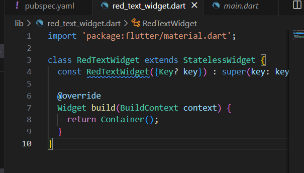
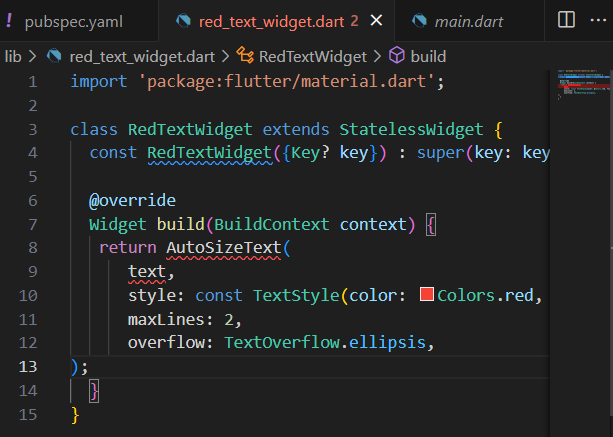
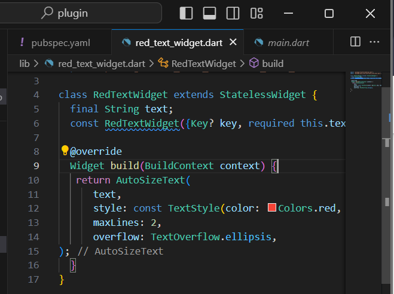
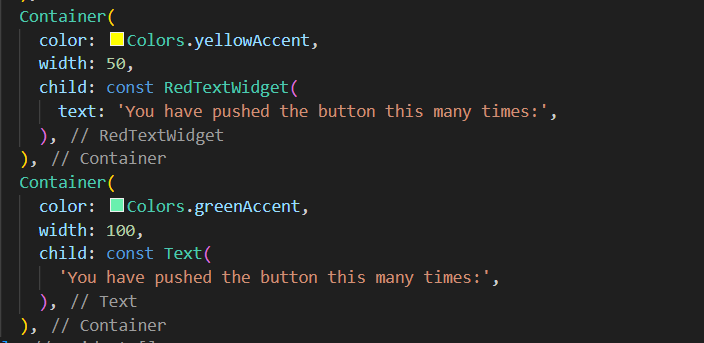
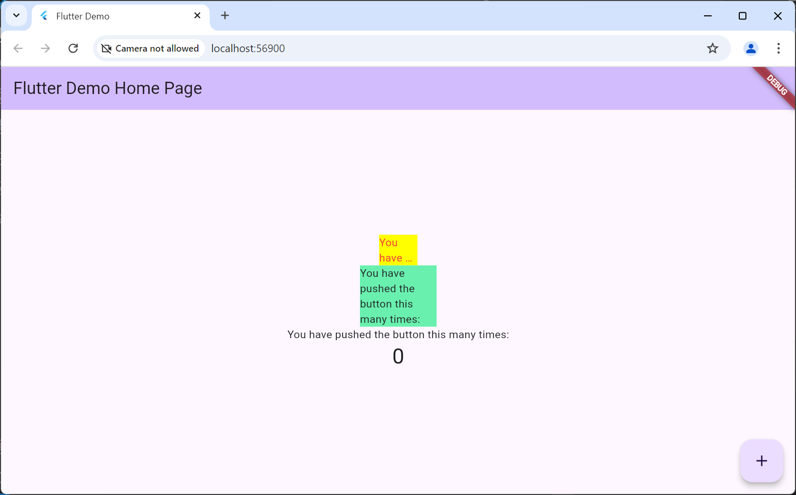
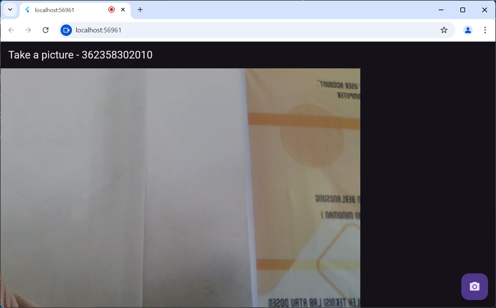
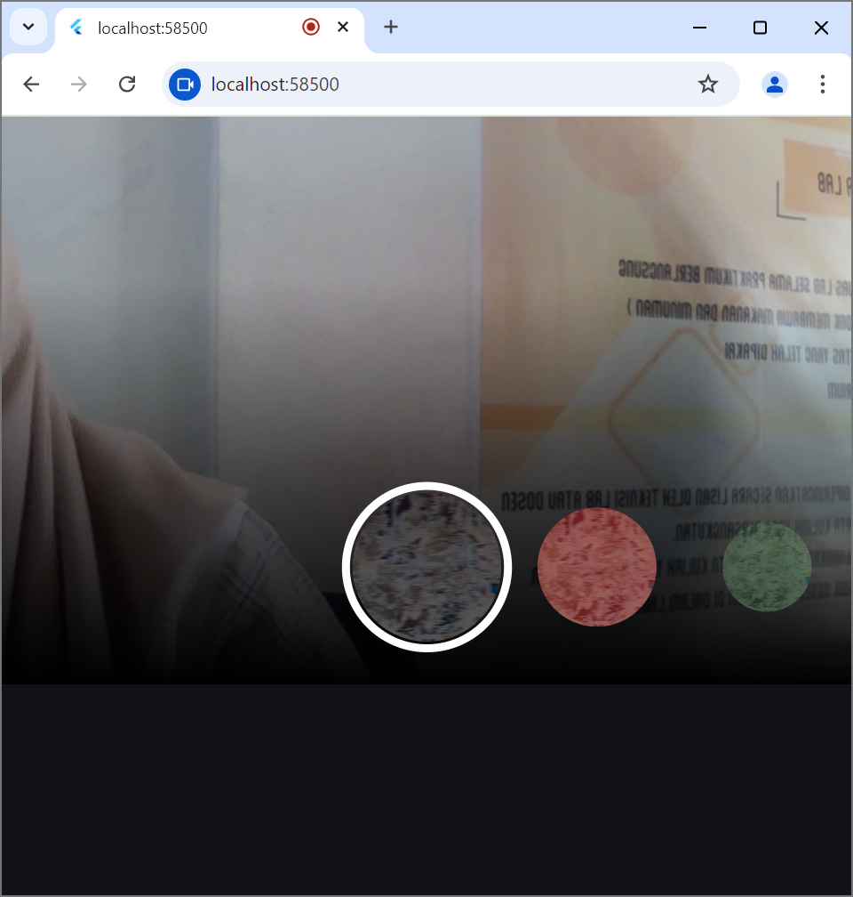

Praktikum Menerapkan Plugin Di Project Flutter:

Langkah 1: Membuat project plugin
Langkah 2: Menambahkan plugin auto_size_text di terminal 
Langkah 3: Membuat file red_text_widget.dart dalam folder lib 

Langkah 4: Rubah return Container() seperti gambar dibawah

Langkah 5: Tambahkan variabel text dan parameter di constructor

Langkah 6: Tambahkan widget di main.dart

Ketika dijalankan akan tampil seperti gambar dibawah ini:

Praktikum TakePicture:

Praktikum Membuat Photo Filter Carousel:
Langkah 1 : Buatlah widget dengan file  filter_selector.dart
Langkah 2: Buatlah file filter_carousel.dart di dalam folder widget
Langkah 3: Buatlah file carousel_flowdelegete.dart
Langkah 4: Buatlah file filter_item.dart

Tugas Praktikum:
Void async adalah fungsi yang memiliki sifat asynchronous yang tidak membutuhkan pengembalian data apapun, digunakan untuk melakukan suatu proses secara tidak langsung.

Fungsi dari anotasi @immutable adalah 

Fungsi dari anotasi @override adalah 

Hasil:
